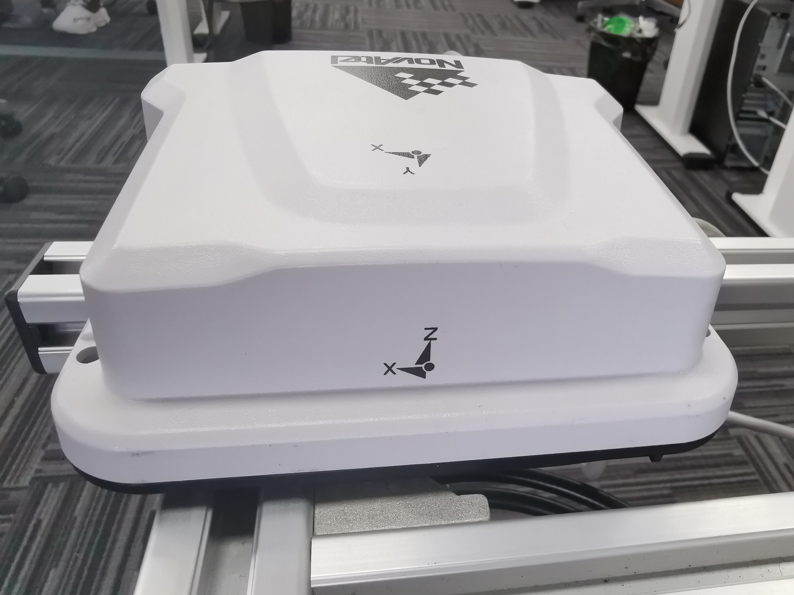
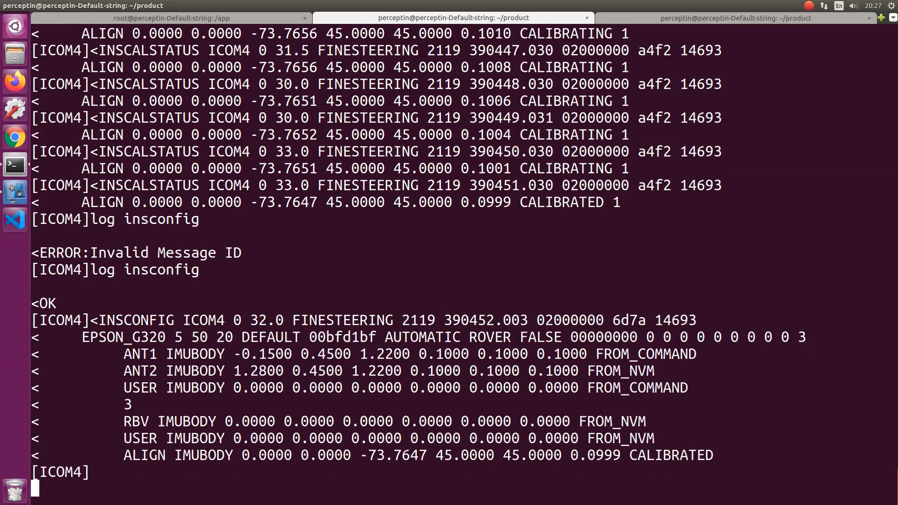
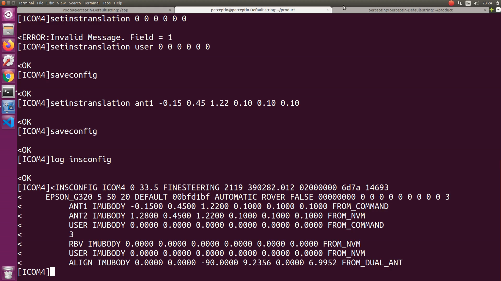
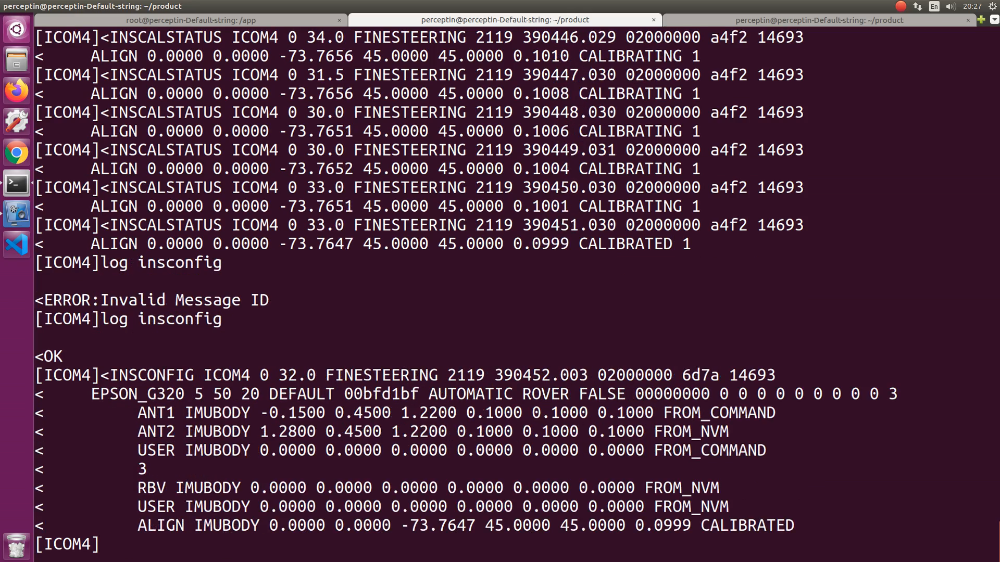
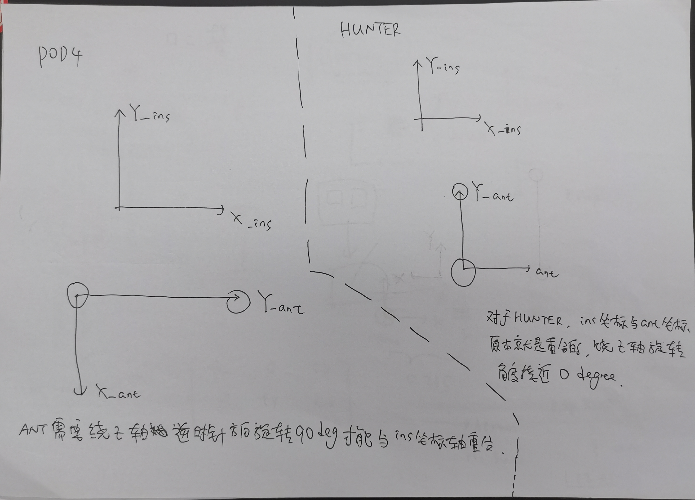
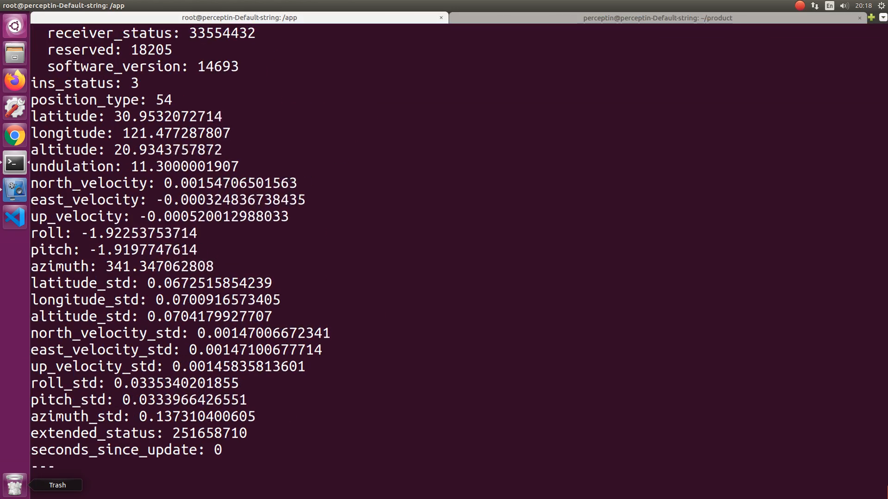
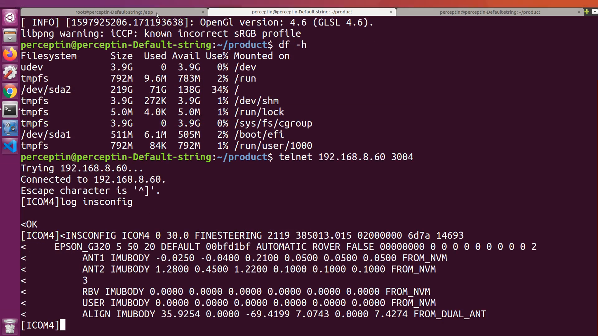

# allrideai

## 坐标系

### PP7坐标系



PP7坐标系已经画在设备上了，x向右，y向前，z向上。关于原点，其实原点肯定只有一个，在设备里面。上图中，其实也清晰地画出了imu x/y/z的原点。不管怎么安装pp7，x指的方向就是pp7 imu的x轴，y指的方向就是pp7 imu的y轴。不同的安装角度，影响的是外参，影响的是pp7和lidar坐标系的旋转角度，以及pp7和车体坐标系的旋转角度。

当在POD4上安装PP7 和 Lidar-32，用作地图车时，PP7的坐标系是: x向右，y向前，z向上。

当在Hunter上安装PP7 和 Lidar-32，用作地图车时，PP7的坐标系是: x向右，y向前，z向上。


## 标定

### (ins 和 rtk 的标定)  /  GNSS/INS Calibration  /  NovAtel Calibration(ANT1, ALIGN, RBV)

#### 1. 双天线到ins杆臂值标定

需要登录到NovAtel，有以下两种方法都可以登录到NovAtel终端，

- telnet 192.168.8.60 3004
- 在浏览器中输入"192.168.8.60"，点击右上角的设置图标，打开浏览器版的终端

所有车辆的杆臂值采用手动测量。

```bash
# set level-arm and std value for dual-ant
# tx/ty/tz的单位是meter，std_tx/std_ty/std_tz为标准差，需要控制在0.03 ~ 0.05m。
setinstranslation ant1 tx ty tz std_tx std_ty std_tz （左天线杆臂值，默认为主天线）
setinstranslation ant2 tx ty tz std_tx std_ty std_tz  (右天线杆臂值)
saveconfig
这些数据会被写入到NovAtel存储器里，也就是NVM。

在<OEM7_Commands_Logs_Manual.pdf>，'4.7 INSCALIBRATE'，'SDThreshold'，有这样一句话"default Standard Deviation Threshold for lever arm calibration = 0.1m"。

比如，在POD4上，

setinstranslation ant1 -0.15 0.45 1.22 0.10 0.10 0.10  # 这条语句表明，主天线在PP7坐标系下的位置是：左边0.15m，前边0.45m，上方1.22m，x/y/z三个方向上允许的误差范围均是0.1m。

setinstranslation ant2 1.05 0.45 1.22 0.10 0.10 0.10  # 这条语句表明，从天线在PP7坐标系下的位置是：右边1.05m，前方0.45m，上方1.22m，x/y/z三个方向上允许的误差范围均是0.1m。

在Hunter上，

setinstranslation ant1 -0.26 -0.04 0.115 0.05 0.05 0.05  # 这条语句表明，Hunter小车上，主天线在PP7坐标系下的位置：-0.26m, -0.04m, 0.115m。x/y/z三个方向上允许的误差范围是0.05m。
setinstranslation ant2 -0.26 0.88 0.23 0.05 0.05 0.05  # 这条语句表明，Hunter小车上，从天线在PP7坐标系下的位置：-0.26m, 0.88m, 0.23m。x/y/z三个方向上允许的误差范围是0.05m。
```

#### 2. 设置输出原点(output origin)，也就是user输出为ins位置

```bash
setinstranslation user 0 0 0 0 0 0  # 这条语句应该会打印 OK message
setinsrotation user 0 0 0 0 0 0  # 这条语句应该会打印 OK message
saveconfig
```

#### 3. ALIGN标定（ins 和 rtk之间的标定）

ALIGN标定的结果是写在了 _config_gnss.cfg_

标定过程可在车体静止下完成，也可以将车体绕8字完成。建议先将车体绕8字绕个1分钟左右，之后静止直至达到收敛条件。

做ALIGN标定的前提条件： /novatel_data/inspvax的"position_type" = 56(RTK_FIXED)，同时"ins_status" = 3(SOLUTION_GOOD)，通常通过将车绕8字来达到此状态。

登录到NovAtel终端，telnet 192.168.8.60 3004 或者登录网页版，启动ALIGN标定，

```bash
# std是用来设置收敛条件的，单位是degree，建议设为0.1 degree，更小的std较难收敛。
inscalibrate align new 0.1
log inscalstatus onchanged  # 查看标定状态更新
saveconfig  # 将标定结果写入NVM存储器
```

当发现"9. Source Status"由 CALIBRATING 变成 CALIBRATED，就表明align的标定过程已经完成。

Source Status
----
ASCII  |  Description
----|----
CALIBRATING  |  offset values是在标定过程中给出的
CALIBRATED  |  offset values是在标定过程完成后给出的
INS_CONVERGING  |  offset values就是初始的输入值。此时，calibration过程还没开始，ins solution还在收敛的过程中，直到ins solution是converged，calibration过程才真正开始




做"inscalibrate align new 0.1"之前的insconfig如下：



完成"inscalibrate align new 0.1"之后的insconfig如下：



可以看到，ALIGN IMUBODY的结果由"0 0 -90 9.2356 0 6.9952 FROM_DUAL_ANT" 变成了 "0 0 -73.7647 45 45 0.0999 CALIBRATED"

运行inscalibrate align new 0.1，依次达到CALIBRATED时输出，

- （第一次）0  0  -73.7647 45 45 0.0999 CALIBRATED
- （第二次）0  0  -73.6808 45 45 0.2789 CALIBRATED
- （第三次）0  0  -82.4248 45 45 0.1614 CALIBRATED
- （第四次）0 -0  -90.2700 45 45 0.0897 CALIBRATED
- （第五次）0 -0  -90.4366 45 45 0.0927 CALIBRATED

到第5次时，就认为已经完成了inscalibrate align new 0.1这个标定过程。

如果很难收敛到设定角度，达到一定角度时，可以敲命令 inscalibrate align stop，此时屏幕打印的align标定的状态会由Calibrating变为Calibrated，如果满足要求的话，此时同样可以认为完成了inscalibrate align。

**注意**：屏幕打印由Calibrating变成Calibrated，只能说明完成了ALIGN标定这个过程，但是标定结果是否能用，可以从以下两个方面来考量。

其一，观察绕z轴的旋转角度，对于POD4，目前看到的这个角度应该是接近-90deg;而对于HUNTER，这个角度应该是接近0deg。对于POD4，如果由Calibrating变为Calibrated时，这个角度是-73.7647deg，与-90deg参考值相差较大时，则说明这一次Align标定虽然完成了，但结果并不理想，还需要继续运行 inscalibrate align new 0.1直至绕z轴的旋转角度接近-90deg为止。



其二，查看dualantenna heading与inspvax的azimuth是否一致，如果相差较大，同样说明结果不满足要求，还需要继续执行 inscalibrate align new 0.1直至这两个角度比较一致为止。此外，还有一种查看角度值的方法，就是先把车摆向正北方向（用手机指南针做参考），查看此时dualantenna heading与inspvax的azimuth是否是接近于0deg或者360deg。

关于如何查看dualantenna heading，可以在NovAtel terminal里，输入log dualantennaheading once来查看，也可以在IPC上通过rostopic echo /novatel_data/dualantennaheading来查看。

#### 4. RBV标定（ins 和 vehicle之间的标定）

RBV标定结果是写在了 _config_imu.cfg_

做RBV标定的前提条件： /novatel_data/inspvax的"position_type" = 56(RTK_FIXED)，同时"ins_status" = 3(SOLUTION_GOOD)，通常通过将车绕8字来达到此状态。

做RBV标定的要求：
- 标定过程需要在一条300 - 500米平坦道路进行，行驶过程中避免方向变化
- 最好道路可以逆行，从一端开始，驶向另一端，如果到终点时已经收敛到目标角度那最好了，但是如果到终点时还没有收敛到目标角度，那么应该先运行inscalibrate rbv stop手动终止，掉头后，运行inscalibrate rbv add继续标定

登录到NovAtel终端，telnet 192.168.8.60 3004 或者登录网页版，启动RBV标定，

```bash
# std是用来设置收敛条件的，单位是degree，建议设为0.05 degree，更小的std较难收敛。
inscalibrate rbv new 0.05
log inscalstatus onchanged  # 查看标定状态更新
inscalibrate rbv stop  # 手动停止标定，此时屏幕打印的标定状态应该由Calibrating 变成Calibrated。
inscalibrate rbv add  # 继续标定
saveconfig  # 将标定结果写入存储器
在<OEM7_Commands_Logs_Manual.pdf>，'4.7 INSCALIBRATE'，'SDThreshold'，有这样一句话"default Standard Deviation Threshold for RBV calibration = 0.5degrees"。
```

当输入 inscalibrate rbv stop时，屏幕上的打印由

RBV 2.5550 0.6705 -0.3149 0.3036 2.1844 0.2195 CALIBRATING 1

RBV 2.5550 0.6705 -0.3149 0.3036 2.1844 0.2195 INSUFFICIENT_SPEED 1

变成了

RBV 2.5550 0.6705 -0.3149 0.3036 2.1844 0.2195 CALIBRATED 1

既输入 inscalibrate rbv stop后，输入 inscalibrate rbv add，继续标定

再次输入 inscalibrate rbv stop，屏幕打印由

RBV 2.3906 1.0029 -0.2068 0.4063 2.6315 0.3284 CALIBRATING 2

RBV 2.3906 1.0029 -0.2068 0.4063 2.6315 0.3284 INSUFFICIENT_SPEED 2

变成了

RBV 2.4728 0.8367 -0.2609 0.2536 1.7100 0.1975 CALIBRATED 2

再次输入 inscalibrate rbv add，继续标定，

第三次输入inscalibrate rbv stop，屏幕打印由

RBV 2.4727 0.3667 -0.0015 0.4285 1.9880 0.3114 CALIBRATING 3

RBV 2.4727 0.3667 -0.0015 0.4285 1.9880 0.3114 INSUFFICIENT_SPEED 3

变成了

RBV 2.4728 0.6800 -0.1744 0.2213 1.3186 0.1677 CALIBRATED 3

第三次输入 inscalibrate rbv add，继续标定，同时

RBV 2.4753 0.5785 -0.2113 0.1724 1.0369 0.1292 CALIBRATED 4

此时已经可以认为完成了rbv校准，前后的insconfig对比如下，

执行rbv calibrate之前，


执行rbv calibrate之后，


可以看到rbv结果已经由

RBV IMUBODY 0 0 0 0 0 0 FROM_NVM

变成了

RBV IMUBODY 2.4753 0.5785 -0.2113 0.1724 1.0369 0.1292 CALIBRATED

#### 5. Lidar和IMU的外参标定 / Lidar - INS


## 制图


## ros topics


topic | 备注
-----|-----
/novatel_data/inspvas  |  未知
/novatel_data/inspvax  |  未知
/rosout  |  未知
/velodyne_32_points  |  未知
  |  未知
  |  未知
  |  未知
  |  未知
  |  未知
  |  未知
  |  未知
  |  未知
  |  未知
  |  未知


- docker exec -it drv_node bash
- source devel/setup.bash


### [rostopic echo /novatel_data/inspvax]

输出示例：



重点关注ins_status和position_type

参见文件novatel_msgs/INSPVAX.msg，可以看到
## ros topics
ins_status
----
value | ASCII | ins_status | definition | description
----|----|----|----|----
3  |  INS_SOLUTION_GOOD  |  SOLUTION_GOOD  |  uint32 INS_STATUS_SOLUTION_GOOD=3  |  The INS filter is in navigation mode and the INS solution is good.
7  |  INS_ALIGNMENT_COMPLETE  |  ALIGNMENT_COMPLETE  |  uint32 INS_STATUS_ALIGNMENT_COMPLETE = 7  |  The INS filter is in navigation mode, but not enough vehicle dynamics have been experienced for the system to be within the specifications.        20201023测试        上午在众冠时代广场楼下完成"inscalibrate align new 0.1"后，下午再去在众冠时代广场楼下打算做"inscalibrate rbv new 0.5"，就一直出现ins_status = 7的状态，之后将车开出广场外的人行道（两边有树遮挡），ins_status一直是7，当开到小河边后ins_status变成了3，因不被允许在小河边测试，后又开回到人行道上，在人行道上空旷区域绕八字后可以进入ins_status=3的状态。


position_type
----
value | ASCII | position_type | definition | description
----|----|----|----|---
53  |  INS_PSRSP  |  PSEUDORANGE_SINGLE_POINT  |  uint32 POSITION_TYPE_PSEUDORANGE_SINGLE_POINT=53  |  single point
54  |  INS_PSRDIFF  |  PSEUDORANGE_DIFFERENTIAL  |  uint32 POSITION_TYPE_PSEUDORANGE_DIFFERENTIAL=54  |  INS pseudorange differential solution（伪距差分）
56  |  INS_RTKFIXED  |  RTK_FIXED  |  uint32 POSITION_TYPE_RTK_FIXED=56  |  INS RTK fixed ambiguities solution


## commands on pp7

通过以下指令登录到pp7，
- telnet 192.168.8.60 3004

### log insconfig

输出示例：



平移量类型  |  含义
----|----
ANT1  |  从IMU中心到主天线相位中心的平移量
ANT2  |  从IMU中心到从天线相位中心的平移量

### setinstranslation

1. setinstranslation user 0 0 0 0 0 0        # 把ins输出设置到ins中心点


第二个问题：在roslaunch-XXX.log里，都出现了哪些"Added node of type"？

node | 备注
-----|-----
localization/gnss_ntrip_client_node  |  会有对应的gnss_ntrip_client_node.INFO log文件
localization/online_gnss_rtk_node  |  会有对应的online_gnss_rtk_node.INFO log文件
localization/sensor_fusion_node  |  会有对应的sensor_fusion_node.INFO log文件
localization/map_registration_node  |  会有对应的map_registration_node.INFO log文件


第三个问题：docker是啥？如何使用？


第四个问题：ros里面的tf到底指的是啥？