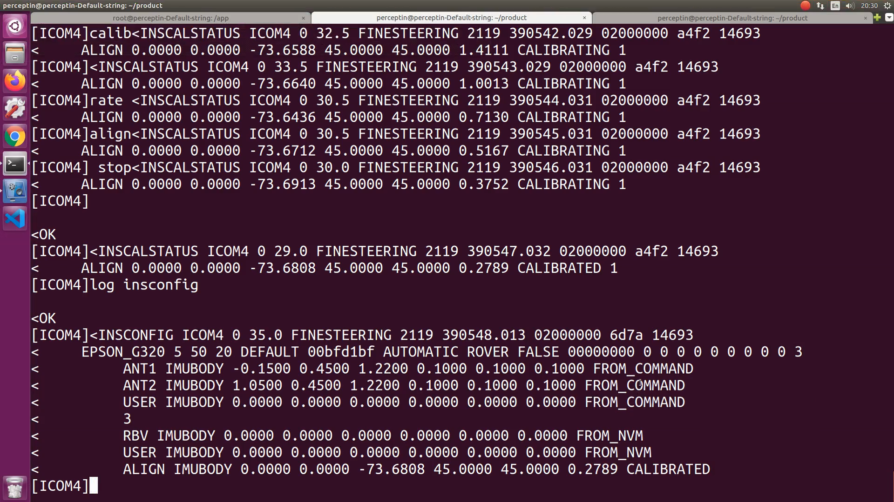
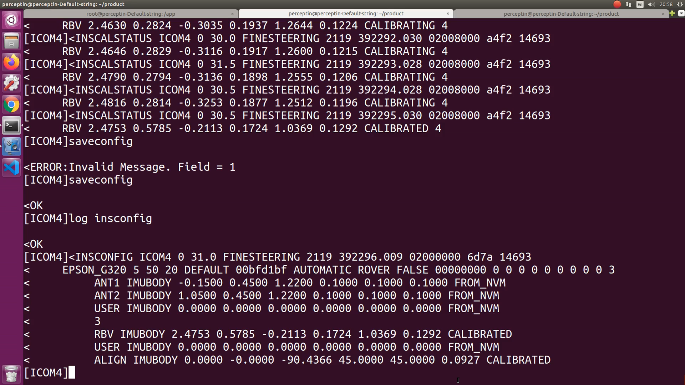

# allrideai

## 坐标系

### PP7坐标系

PP7坐标系已经画在设备上了，一般是x向右，y向前。不管怎么安装pp7，x指的方向就是pp7 imu的x轴，y指的方向就是pp7 imu的y轴。不同的安装角度，影响的是pp7和lidar坐标系的旋转角度，以及pp7和车体坐标系的旋转角度。

## 标定

当在POD4上安装PP7和Lidar-32，用作地图车时，PP7的坐标系：x向右，y向前，z向上。

setinstranslation ant1 -0.15 0.45 1.22 0.10 0.10 0.10  # 这条语句表明，主天线在PP7坐标系下的位置是：左边0.15m，前边0.45m，上方1.22m，x/y/z三个方向上允许的误差范围均是0.1m。

setinstranslation ant2 1.05 0.45 1.22 0.10 0.10 0.10  # 这条语句表明，从天线在PP7坐标系下的位置是：右边1.05m，前方0.45m，上方1.22m，x/y/z三个方向上允许的误差范围均是0.1m。

1. 运行 inscalibrate align new 0.1

default "Standard Deviation Threshold" for lever arm caibration is 0.5m. 杆臂值标定的默认误差是0.5m。

敲命令 log inscalstatus onchanged

当发现"9. Source Status"由 CALIBRATING 变成 CALIBRATED，就表明align的标定过程已经完成。

Source Status
----
ASCII  |  Description
----|----
CALIBRATING  |  offset values是在标定过程中给出的
CALIBRATED  |  offset values是在标定过程完成后给出的
INS_CONVERGING  |  offset values就是初始的输入值。此时，calibration过程还没开始，直到ins solution是converged，calibration过程才真正开始

做"inscalibrate align new 0.1"之前的insconfig如下：

完成"inscalibrate align new 0.1"之后的insconfig如下：

可以看到，ALIGN IMUBODY的结果由"0 0 -90 9.2356 0 6.9952 FROM_DUAL_ANT" 变成了 "0 0 -73.7647 45 45 0.0999 CALIBRATED"

运行inscalibrate align new 0.1，依次达到CALIBRATED时输出，

- （第一次）0  0  -73.7647 45 45 0.0999 CALIBRATED
- （第二次）0  0  -73.6808 45 45 0.2789 CALIBRATED
- （第三次）0  0  -82.4248 45 45 0.1614 CALIBRATED
- （第四次）0 -0  -90.2700 45 45 0.0897 CALIBRATED
- （第五次）0 -0  -90.4366 45 45 0.0927 CALIBRATED

到第5次时，就认为已经完成了inscalibrate align new 0.1这个标定过程。

2. 运行 inscalibrate rbv new 0.05

default "Standard Deviation Threshold" rbv calibration is 0.5 degree. 默认的rbv标定的误差是0.5度。

当输入 inscalibrate rbv stop时，屏幕上的打印由

RBV 2.5550 0.6705 -0.3149 0.3036 2.1844 0.2195 CALIBRATING 1

RBV 2.5550 0.6705 -0.3149 0.3036 2.1844 0.2195 INSUFFICIENT_SPEED 1

变成了

RBV 2.5550 0.6705 -0.3149 0.3036 2.1844 0.2195 CALIBRATED 1

既输入 inscalibrate rbv stop后，输入 inscalibrate rbv add，继续标定

再次输入 inscalibrate rbv stop，屏幕打印由

RBV 2.3906 1.0029 -0.2068 0.4063 2.6315 0.3284 CALIBRATING 2

RBV 2.3906 1.0029 -0.2068 0.4063 2.6315 0.3284 INSUFFICIENT_SPEED 2

变成了

RBV 2.4728 0.8367 -0.2609 0.2536 1.7100 0.1975 CALIBRATED 2

再次输入 inscalibrate rbv add，继续标定，

第三次输入inscalibrate rbv stop，屏幕打印由

RBV 2.4727 0.3667 -0.0015 0.4285 1.9880 0.3114 CALIBRATING 3

RBV 2.4727 0.3667 -0.0015 0.4285 1.9880 0.3114 INSUFFICIENT_SPEED 3

变成了

RBV 2.4728 0.6800 -0.1744 0.2213 1.3186 0.1677 CALIBRATED 3

第三次输入 inscalibrate rbv add，继续标定，

此时，屏幕上出现了第4次 CALIBRATED，如下，

RBV 2.4753 0.5785 -0.2113 0.1724 1.0369 0.1292 CALIBRATED 4

此时已经可以认为完成了rbv校准，前后的insconfig对比如下，

执行rbv calibrate之前，

执行rbv calibrate之后，

可以看到rbv结果已经由

RBV IMUBODY 0 0 0 0 0 0 FROM_NVM

变成了

RBV IMUBODY 2.4753 0.5785 -0.2113 0.1724 1.0369 0.1292 CALIBRATED

## 制图

## ros topics

topic | 备注
-----|-----
/novatel_data/inspvas  |  未知
/novatel_data/inspvax  |  未知
/rosout  |  未知
/velodyne_32_points  |  未知
  |  未知
  |  未知
  |  未知
  |  未知
  |  未知
  |  未知
  |  未知
  |  未知
  |  未知
  |  未知

- docker exec -it drv_node bash
- source devel/setup.bash

### [rostopic echo /novatel_data/inspvax]

输出示例：

重点关注ins_status和position_type

参见文件novatel_msgs/INSPVAX.msg，可以看到
## ros topics
ins_status
----
value | ASCII | ins_status | definition | description
----|----|----|----|----
3  |  INS_SOLUTION_GOOD  |  SOLUTION_GOOD  |  uint32 INS_STATUS_SOLUTION_GOOD=3  |  The INS filter is in navigation mode and the INS solution is good.
7  |  INS_ALIGNMENT_COMPLETE  |  ALIGNMENT_COMPLETE  |  uint32 INS_STATUS_ALIGNMENT_COMPLETE = 7  |  The INS filter is in navigation mode, but not enough vehicle dynamics have been experienced for the system to be within the specifications.        20201023测试        上午在众冠时代广场楼下完成"inscalibrate align new 0.1"后，下午再去在众冠时代广场楼下打算做"inscalibrate rbv new 0.5"，就一直出现ins_status = 7的状态，之后将车开出广场外的人行道（两边有树遮挡），ins_status一直是7，当开到小河边后ins_status变成了3，因不被允许在小河边测试，后又开回到人行道上，在人行道上空旷区域绕八字后可以进入ins_status=3的状态。

position_type
----
value | ASCII | position_type | definition | description
----|----|----|----|---
53  |  INS_PSRSP  |  PSEUDORANGE_SINGLE_POINT  |  uint32 POSITION_TYPE_PSEUDORANGE_SINGLE_POINT=53  |  single point
54  |  INS_PSRDIFF  |  PSEUDORANGE_DIFFERENTIAL  |  uint32 POSITION_TYPE_PSEUDORANGE_DIFFERENTIAL=54  |  INS pseudorange differential solution（伪距差分）
56  |  INS_RTKFIXED  |  RTK_FIXED  |  uint32 POSITION_TYPE_RTK_FIXED=56  |  INS RTK fixed ambiguities solution

## commands on pp7

通过以下指令登录到pp7，
- telnet 192.168.8.60 3004

### log insconfig

输出示例：

平移量类型  |  含义
----|----
ANT1  |  从IMU中心到主天线相位中心的平移量
ANT2  |  从IMU中心到从天线相位中心的平移量

### setinstranslation

1. setinstranslation user 0 0 0 0 0 0        # 把ins输出设置到ins中心点

第二个问题：在roslaunch-XXX.log里，都出现了哪些"Added node of type"？

node | 备注
-----|-----
localization/gnss_ntrip_client_node  |  会有对应的gnss_ntrip_client_node.INFO log文件
localization/online_gnss_rtk_node  |  会有对应的online_gnss_rtk_node.INFO log文件
localization/sensor_fusion_node  |  会有对应的sensor_fusion_node.INFO log文件
localization/map_registration_node  |  会有对应的map_registration_node.INFO log文件

第三个问题：docker是啥？如何使用？

第四个问题：ros里面的tf到底指的是啥？